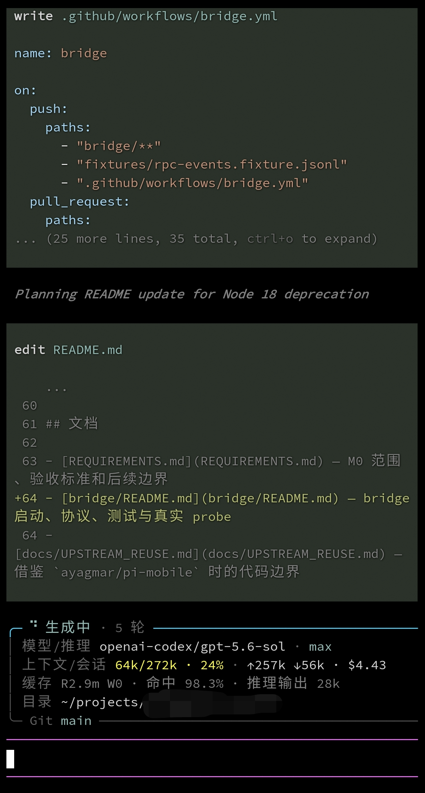

# Termux 中文扁字修复 — 混合字体一键安装

**Source Code Pro Nerd Mono（拉丁/Nerd 图标）+ 更纱黑体（CJK）+ Noto 符号** 三合一混合字体，为 Termux / ZeroTermux 定制，**v8 最终版**。

## 效果



（ZeroTermux 实机效果：中文方正、括号/标点位置正常、Nerd 图标与 Unicode 符号（⏵⏸✻⎿ 等）完整）

## 为什么有这个字体

Termux 系终端渲染中文"扁"的根因（源码级发现）：

> `TerminalRenderer.drawTextRun` 会量每个字符的实测宽度，与 wcwidth 期望格数对比，偏差 >1% 就 `canvas.scale` 横向拉伸。CJK 字形宽度 ≠ 2×主字体 X 宽度时必被拉扁（系统 Noto 也中招）。

**解法**：把更纱 CJK 字形等比 1.1 倍、advance 精确设为 1200units（= 2×SourceCodePro X 宽 600）——渲染器实测恰 2.00 格，不触发缩放，中文保持方正。

## 字体参数（v8 最终版）

| 参数 | 值 |
|---|---|
| 拉丁/图标 | Source Code Pro Nerd Mono Regular |
| CJK 字形 | Sarasa Term SC Regular（等比 1.1×） |
| 符号字形 | Noto Sans Symbols 2 / Noto Sans Symbols / DejaVu Sans（见下） |
| CJK advance | 1200units（= 2×X 宽，骗过渲染器 scale 逻辑） |
| 符号 advance | 600units（恰好 1 格，水平居中） |
| lsb | **= 每个字形真实 xMin**（关键修复，见下） |
| 行高 | ascent 965 / descent -215 / lineGap 250（总 1430） |
| OS/2 | ulUnicodeRange 声明 CJK 位（防 Android fallback） |
| 尺寸 | 14.3MB，40,595 个 CJK 字形 + 20 个符号字形（共 52,759） |

## v8：补齐 UI 符号

Nerd 补丁只往私有区加图标（Powerline/FontAwesome/Material），**不含 Unicode 符号区**。于是 Claude Code 的 `⏵⏵`（accept edits 模式）、`⏸`（plan 模式）、思考转圈 `✻✢✳✶✽`、工具结果树 `⎿` 等全部渲染成空框——`patch_symbols8.py` 把 20 个字形补进来（源字体缺失时自动下载），个别只有 Android 系统字体才有的从 `/system/fonts/NotoSansSymbols-Regular-Subsetted*.ttf` 兜底。

处理方法与 CJK 一致：等比缩放（不放大）→ **水平居中到单格、advance 精确 = 600（1 格）** → **lsb = 字形真实 xMin**（否则窄符号会贴格子左边，见坑 2）。

补的码位：`✗ ✻ ✢ ✱ ✳ ✶ ✽ ⎿ ⏺ ⏵ ⏸ ⏰ ⤓ ↳ ⇥ ↵ ⚙ ⚠ ⌘ ⬜`

## 两个渲染层坑（都踩过）

**坑 1：TerminalRenderer 的 scale 逻辑** — 实测字符宽度 ≠ wcwidth 期望格数时横向拉伸。CJK advance 必须精确 = 2×X 宽（1200 = 2×600），否则字形被拉扁（系统 Noto 也中招）。

**坑 2：freetype/Android 按 hmtx.lsb 定位字形绘制起点**（不是字形轮廓坐标！）— 统一设 LSB=50 会把窄字形（括号/标点）全部推到格子最左边，看起来"左对齐"。**lsb 必须 = 每个字形真实 xMin**（TrueType 规范本来就这样要求）。

## 安装

```bash
# 一键（本地有成品或自动从 GitHub 下载）
./install.sh

# 从源字体重新合并构建（需 python3 + fonttools + p7zip）
./install.sh --from-source
```

**安装后必须【完全退出】Termux/ZeroTermux（最近任务划掉）再重开**——字体是进程级缓存，新建会话不会重新加载。

## 迁移到新设备

```bash
pkg install curl 2>/dev/null
curl -sL https://raw.githubusercontent.com/wmdhs12138/termux-zh-font-fix/main/install.sh | bash
# 完事！退出重开即可
```

## 调参

改 `merge_font7.py` 顶部的常量（SCALE / NEW_ADVANCE / LSB / LINEGAP）后 `./install.sh --from-source` 重新构建；符号的 CELL / TARGET_W / TARGET_H 在 `patch_symbols8.py` 顶部。

```python
SCALE = 1.1        # CJK 字形等比缩放
NEW_ADVANCE = 1200 # 目标 advance（必须 = 2×X 宽）
LSB = 50           # 旧版字距参数（v7 已废弃，lsb 自动取真实 xMin）
LINEGAP = 250      # 额外行距（行高 1430）
```

## 文件

- `SourceCodeProNerdMono-CJK8.ttf` — 成品字体（直接 `cp` 到 `~/.termux/font.ttf` 也行）
- `SourceCodeProNerdMono-CJK7.ttf` — 旧版（无符号字形，留档）
- `merge_font7.py` — 拉丁+Nerd / CJK 合并脚本（fontTools，含 lsb=xMin 修复）
- `patch_symbols8.py` — 在 v7 上补 20 个 UI 符号字形，输出 v8（源字体自动下载）
- `install.sh` — 一键安装脚本

## 相关研究

- [Termux 渲染"扁"字机制](https://github.com/termux/termux-app) — TerminalRenderer.drawTextRun scale 逻辑
- 源字体：ryanoasis/nerd-fonts（SourceCodePro v3.5.0）、be5invis/Sarasa-Gothic（v1.0.40）、Google Noto Sans Symbols 2、dejavu-fonts（v2.37）
