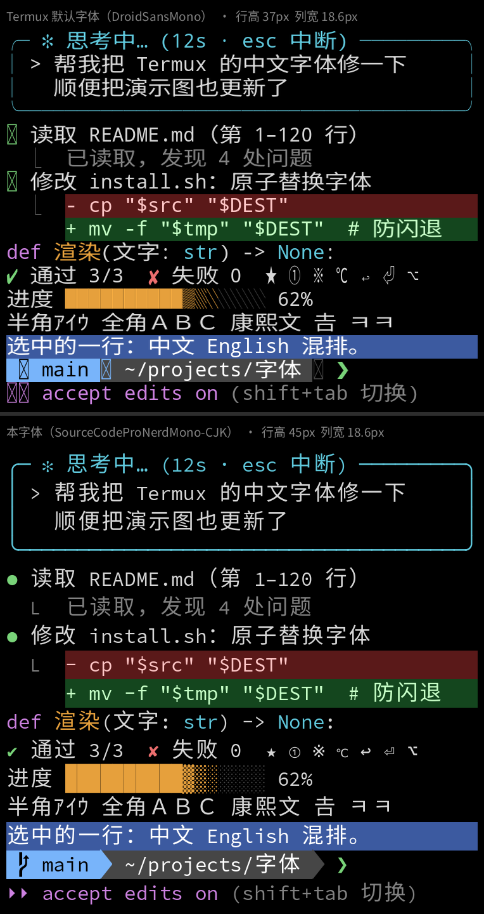

# Termux 中文字体修复

给 Termux / ZeroTermux / NewTermux 用的等宽混合字体，解决中文被拉扁、制表符断线、符号缺字的问题：
**Source Code Pro Nerd Mono**（拉丁字母、Nerd 图标）+ **更纱黑体 Term SC**（中日韩）+ 常用符号补全。



上：Termux 默认字体；下：本字体。图由 `tools/preview.py` 按 Termux 的排版逻辑离线渲染（字号 31px）。

## 安装

```bash
curl -fsSL https://raw.githubusercontent.com/wmdhs12138/termux-zh-font-fix/main/install.sh | bash
```

已经克隆了仓库就直接 `./install.sh`。装完要**完全退出 Termux（最近任务里划掉）再打开**——字体是进程级缓存，新开会话不会重新加载。

> 手动换字体别直接 `cp` 覆盖 `~/.termux/font.ttf`：Termux 是 mmap 着这个文件渲染的，原地覆盖会让它当场闪退。先拷到同目录的临时文件再 `mv`：
>
> ```bash
> cp 新字体.ttf ~/.termux/font.ttf.new && mv -f ~/.termux/font.ttf.new ~/.termux/font.ttf
> ```

## 为什么中文会扁

Termux 的 `TerminalRenderer` 逐字测量宽度，和 `wcwidth` 算出的格数相差 1% 以上，就把这个字横向缩放进格子。等宽字体一格约 0.6em，两格 1.2em，而系统字体的中文只有 1em 宽——于是被横向拉宽 1.2 倍，看起来是扁的。

这个字体按 Termux 实际的渲染规则逐项对齐：

| Termux 的行为 | 字体的对策 |
|---|---|
| 字宽 ≠ wcwidth × 格宽就缩放 | 单格 600、双格 1200 units，分毫不差；wcwidth 用 Termux 自己的表（从 APK 字节码解出），不用 Python/系统的 Unicode 表 |
| FreeType 按 `hmtx.lsb` 定位绘制起点 | 合入和改动过的字形 lsb 一律等于真实 xMin，否则窄标点会贴到格子左边 |
| 行距（leading）整块放在行底 | lineGap 为 0，行距全部放进 ascent/descent，文字在行内垂直居中 |
| 行高向上取整（`ceil`） | 制表符、方块、Powerline 分隔符上下各超出行高 20 units，行与行之间不留缝 |
| 只加载一个 `font.ttf`，粗体用 `setFakeBoldText` 描边、斜体用错切 | 没法提供真正的粗体/斜体——这是 app 的限制 |

## 规格

| 项 | 值 |
|---|---|
| 拉丁 / 图标 | Source Code Pro Nerd Font Mono v3.5.0 Regular |
| 中日韩 | 更纱黑体 Term SC v1.0.40 Regular，放大 1.1 倍、居中于两格；缺的边角区（谚文兼容字母、注音扩展、扩展 B 等）取系统 Noto Sans CJK SC（同为思源黑体字形） |
| 符号 | DejaVu Sans Mono 优先，其次 Noto Sans Symbols 2、Noto Sans Symbols、DejaVu Sans、系统 Noto Symbols |
| 度量 | 1000 units/em，单格 600，ascent 1090 / descent −340 / lineGap 0（行高 1.43em） |
| 规模 | 57,510 个字形，15.5MB |

## 自己构建和调参

```bash
python3 build/build.py        # 从源字体构建，覆盖根目录的 SourceCodeProNerdMono-CJK.ttf
./install.sh --from-source    # 构建后直接安装
```

需要 `python3`、`fonttools`、`p7zip`（`pkg install p7zip`）。首次运行会下载约 60MB 源字体到 `~/.cache/termux-zh-font-fix`，下载地址锁定到具体版本并校验 sha256。源字体和参数不变时，构建结果与仓库里的成品逐字节相同。

构建分三步，参数在各自文件的顶部：

| 文件 | 做什么 | 主要参数 |
|---|---|---|
| `build/step1_merge_cjk.py` | 把更纱的中日韩字形合进 Source Code Pro | `SCALE` 中文放大倍数、`ADVANCE` 双格宽 |
| `build/step2_ui_symbols.py` | 补 Claude Code 等 TUI 常用的 20 个 UI 符号 | `NEED`、`TARGET_W` / `TARGET_H` |
| `build/step3_termux_fit.py` | 行高、铺满类字形拉伸、宽度对齐 wcwidth、整块补符号和 CJK 边角字 | `ASC` / `DESC`（行高 = ASC − DESC）、`OVERLAP`、`SYM_W` / `SYM_H` |

调参时先离线预览，不用反复重启 Termux（预览需要 `pip install pillow`）：

```bash
python3 build/build.py -o $TMPDIR/test.ttf
python3 tools/preview.py ~/storage/downloads/cmp.png ~/.termux/font.ttf $TMPDIR/test.ttf --labels 当前,试验
```

满意后运行 `python3 build/build.py` 输出到根目录，再 `./install.sh`。字体有改动时，把 `build/build.py` 里的 `FONT_TIMESTAMP` 改成当天，并在 [CHANGELOG](CHANGELOG.md) 记一笔。

- Termux 升级后：重跑 `python3 tools/extract_wcwidth.py` 更新 wcwidth 表，再重新构建。
- 重新生成演示图：`python3 tools/preview.py assets/demo.png /system/fonts/DroidSansMono.ttf SourceCodeProNerdMono-CJK.ttf --labels "Termux 默认字体（DroidSansMono）,本字体（SourceCodeProNerdMono-CJK）"`

## 目录

```
SourceCodeProNerdMono-CJK.ttf  成品字体
install.sh                     一键安装
build/                         构建流水线，入口 build.py
tools/preview.py               按 Termux 排版逻辑离线渲染对比图
tools/extract_wcwidth.py       从 Termux APK 提取 wcwidth 表
assets/demo.png                演示图
CHANGELOG.md                   版本历史
```
